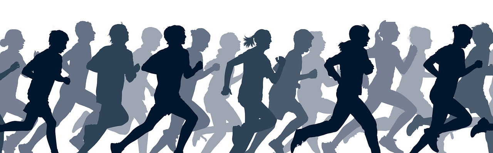

```{r setup, include=FALSE}
library(flexdashboard)
# Install thematic and un-comment for themed static plots (i.e., ggplot2)
# thematic::thematic_rmd()
library(ggplot2)
library(paqueteMET)
library(wordcloud)
library(plotrix)

data("CarreraLuz22")

  
Theme2 = theme(
  axis.title.x = element_text(size = 8),
  axis.text.x = element_text(size = 8),
  axis.title.y = element_text(size = 8),
  # axis.text.y = element_blank(),
  axis.text = element_text( size = 8),
  legend.title = element_text(size = 8),
  legend.text = element_text(size = 8),  
  strip.text = element_text(size=8),
  title =element_text(size=8, face='bold')
)# tamaño letra por grupos

# subsets-----------------------------------------------------------------------
CarreraLuz22$sex[CarreraLuz22$sex == "M"]="Hombre"
CarreraLuz22$sex[CarreraLuz22$sex == "F"]="Mujer"
#-------------------------------------------------------------------------------
CarreraLuz22M = subset(CarreraLuz22, CarreraLuz22$sex=="Hombre")
CarreraLuz22F = subset(CarreraLuz22, CarreraLuz22$sex=="Mujer")
CarreraLuz22Cali = subset(CarreraLuz22, CarreraLuz22$origen=="Cali")
#-------------------------------------------------------------------------------
CarreraLuz22_c1M = subset(CarreraLuz22M, CarreraLuz22M$categoria=="1. Juvenil")
CarreraLuz22_c2M = subset(CarreraLuz22M, CarreraLuz22M$categoria=="2. Abierta")
CarreraLuz22_c3M = subset(CarreraLuz22M, CarreraLuz22M$categoria=="3. Veteranos A")
CarreraLuz22_c4M = subset(CarreraLuz22M, CarreraLuz22M$categoria=="4. Veteranos B")
CarreraLuz22_c5M = subset(CarreraLuz22M, CarreraLuz22M$categoria=="5. Veteranos C")


CarreraLuz22_c1F = subset(CarreraLuz22F, CarreraLuz22F$categoria=="1. Juvenil")
CarreraLuz22_c2F = subset(CarreraLuz22F, CarreraLuz22F$categoria=="2. Abierta")
CarreraLuz22_c3F = subset(CarreraLuz22F, CarreraLuz22F$categoria=="3. Veteranos A")
CarreraLuz22_c4F = subset(CarreraLuz22F, CarreraLuz22F$categoria=="4. Veteranos B")
CarreraLuz22_c5F = subset(CarreraLuz22F, CarreraLuz22F$categoria=="5. Veteranos C")
#-------------------------------------------------------------------------------

categoria= c("Juvenil","Abierta","Veteranos A", "Veteranos B","Veteranos C")
t2 = aggregate(CarreraLuz22$timerun/60, by=list(CarreraLuz22$categoria,CarreraLuz22$sex), FUN= summary)
t2=t2$x
t2m=t2[1:5,] 
row.names(t2m)=categoria
t2h=t2[6:10,] 
row.names(t2h)=categoria
```

## Column {.tabset data-width="700"}

### Tiempos de carrera

```{r}
paleta6=c("#447270", "#6B9493", "#F6E271", "#F6B916", "#F69312", "#BC6C25")
p1=ggplot(CarreraLuz22F, aes(y=timerun/60, x=categoria))+
  geom_jitter(color="#034A94", size=1, alpha=0.9) +
  aes(color=paleta6)+
  labs(title = " ",
       y= "tiempo - min",
       x= "categorías")+ 
  #facet_wrap(~ sex)
  #facet_grid(vars(sex), scale="free")+
  ylim(0,170)+
  Theme2

p1

```

### Hombre por categorías

```{r, fig.height=3}
ggplot(CarreraLuz22M, aes(x = categoria, y = timerun/60 )) +
  geom_boxplot(aes(fill = categoria)) + 
  # facet_wrap(~sex, ncol=1, labeller = labeller(dose = etiquetas))+
  labs(title = "", y= "tiempo - min", x= "categorías")+
  scale_fill_brewer() +
  #scale_fill_manual(values = c("#00070D", "#012447", "#034A94", "#0570E1", "#3998FB","#37B6FC"))+
  theme(legend.position = "none")
t2h
```

### Mujeres por categoría

```{r, fig.height=3}
ggplot(CarreraLuz22F, aes(x = categoria, y = timerun/60 )) +
  geom_boxplot(aes(fill = categoria)) + 
  # facet_wrap(~sex, ncol=1, labeller = labeller(dose = etiquetas))+
  labs(title = "", y= "tiempo - min", x= "categorías")+
  scale_fill_brewer() +
  #scale_fill_manual(values = c("#00070D", "#012447", "#034A94", "#0570E1", "#3998FB","#37B6FC"))+
  theme(legend.position = "none")
t2m
```

### Más información

```{r, echo=FALSE, out.width="30%", fig.align = "center"}

```

**10.07 K** Participantes desde los 15 años en adelante.

**Salida**: Hotel Intercontinental, calle 5, Carrera 6, carrera 4c, carrera1, carrera 4, calle de la escopeta, museo arqueológico la merced, bulevar del rio, puente Ortiz, av 2N, parque lineal rio Cali av2n, calle 25, parque lineal av1n, calle 13, carrera 1 calle 12, carrera 5, calle 10, gobernación del valle, edificio Aristi carrera 9, calle 9 plazoleta de san francisco, bulevar del rio, calle 8, carrera 4, carrera 3ª, parque del peñón, carrera 3, carrera 3ª oeste, calle 5 oeste, carrera 4, av Belalcázar, carrera 2ª oeste, librería nacional, carrera 1c, museo la tertulia, av Colombia, pepe ganga, carrera 3, carrera 2, carrera 3ª, av Colombia, carrera 4, meta hotel intercontinental. [juanchocorrelon.com](https://juanchocorrelon.com/intercontinental-10k-luz-2022/#10k) \### Origen segùn tiempo en carrera

### WordCloud Ciudad de Origen de acuerdo al tiempo de carrera
```{r}
set.seed(1234) 
wordcloud(words = CarreraLuz22$origen, freq = CarreraLuz22$timerun, min.freq = 1,           max.words=1200, random.order=FALSE, rot.per=0.35,            colors=brewer.pal(8, "Dark2"))
```

### Porcentaje de Atletas vs. sexo
```{r}
athletes <- c(length(CarreraLuz22M$sex),length(CarreraLuz22F$sex))
 
piepercent<- round(100 * athletes / sum(athletes), 1)
 
pie3D(athletes, labels = piepercent,
    main = "Porcentaje de Atletas vs. sexo", col = rainbow(length(athletes)))
legend("topright", c("Hombres","Mujeres"),
                    cex = 0.5, fill = rainbow(length(athletes)))
```

### Edad de atletas segùn el sexo
```{r}
boxplot(CarreraLuz22$edad~CarreraLuz22$sex,
main = "Edad de atletas segùn el sexo",
ylab="Edad",
xlab = "sexo", las=1,
col=c("#f4d35e","#9DECCA"))
```

### Tiempo de carrera segùn el sexo
```{r}
boxplot(CarreraLuz22$timerun/60~CarreraLuz22$sex,
main = "Tiempo de carrera segùn el sexo",
ylab="Tiempo de carrera (min)",
xlab = "sexo", las=1,
col=c("#E5A2F9","#9DECCA"))
```

Column {data-width="400"}
-----------------------------------------------------------------------

### Tiempo mujeres categoría Abierta

```{r}
# seleccion de bases
dataFc2=subset(CarreraLuz22, (CarreraLuz22$sex=="Mujer" & CarreraLuz22$categoria=="2. Abierta")) # dataset de mujeres
x=dataFc2$timerun/60
hist(x, xlim=c(30,120), ylim=c(0,80),las=1,
main = " ",
xlab="tiempo (min)",
ylab = "frecuencia",
col ="#9DECCA")
```

### Tiempo hombres categoría Abierta

```{r}
# seleccion de bases
dataMc2=subset(CarreraLuz22, (CarreraLuz22$sex=="Hombre" & CarreraLuz22$categoria=="2. Abierta")) # dataset de mujeres
x=dataMc2$timerun/60
hist(x, xlim=c(30,120), ylim=c(0,250),las=1,
main = " ",
xlab="tiempo (min)",
ylab = "frecuencia",
col ="#9DECCA")
```

## Column {data-width="50"}

### minimo {.value-box}

```{r}
valueBox(value =paste(round(min(CarreraLuz22$timerun/60),1), "min"), 
         caption = "Tiempo ganador", 
         icon = "fa-thumbs-up", 
         color = "#D6FE33")
```

### promedio {.value-box}

```{r}
valueBox(value = paste(round(mean(CarreraLuz22$edad),2),"Años"), 
         caption = "Edad promedio de atletas", 
         icon = "  ", 
         color = "#C89DEC")
```
### porcentaje {.value-box}

```{r}
valueBox(value = paste(round(length(CarreraLuz22Cali$origen)/length(CarreraLuz22$origen)*100,2),"%"), 
         caption = "Porcentaje de atletas caleños", 
         icon = "  ", 
         color = "#F4DA1F")
```

### velocidad {.value-box}

```{r}
valueBox(value =paste(round(10070/min(CarreraLuz22$timerun),2),"m/s"), # ud1$cierre, 
         caption = "Máxima velocidad", 
         icon = "fa-clock", 
         color = "#D3B0F6")
```

### distancia {.value-box}

```{r}
valueBox(value = paste(10.07,"Km"), #ud1$min, 
         caption = "Distancia recorrida", 
         icon = "fa-solod fa-person-walking-arrow-right", 
         color = "#C1EC9D")
```

### volumen {.value-box}

```{r}
valueBox(value = paste(length(CarreraLuz22$timerun),"atletas"), 
         caption = "Número de participantes", 
         icon = "fa-people", 
         color = "#9DECCA")
```


